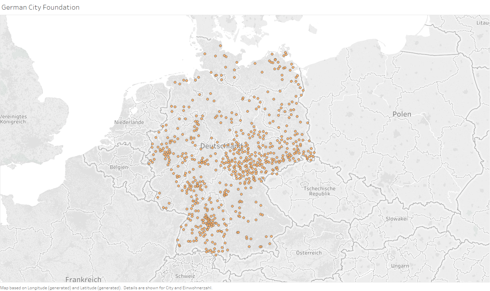
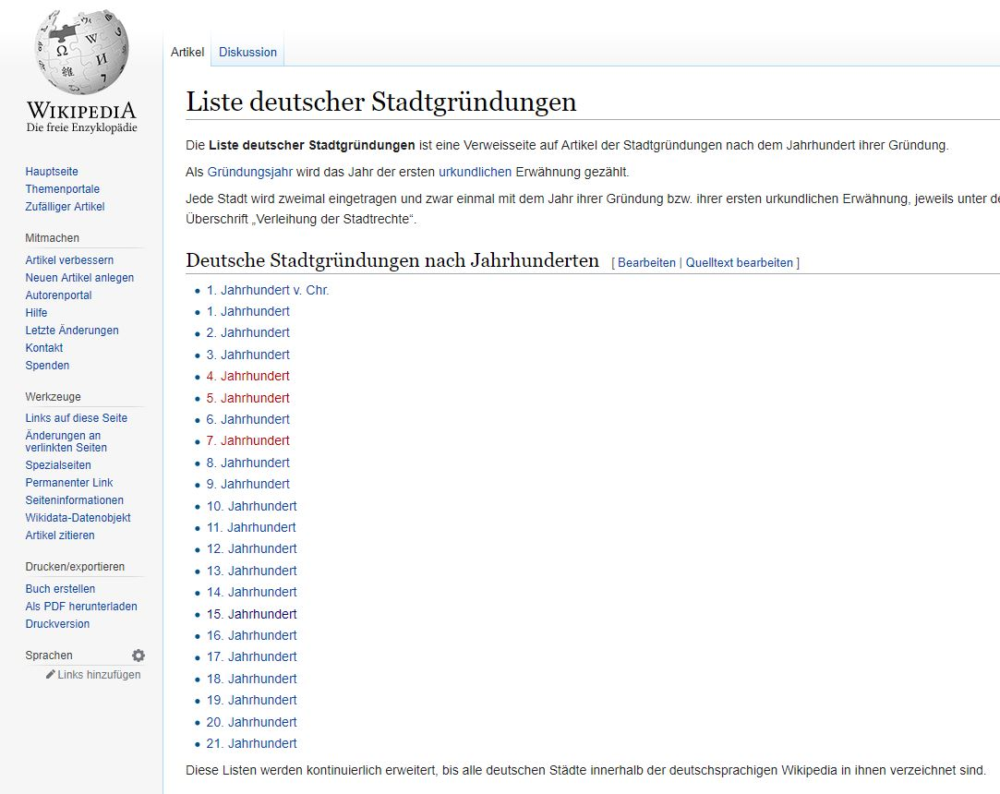
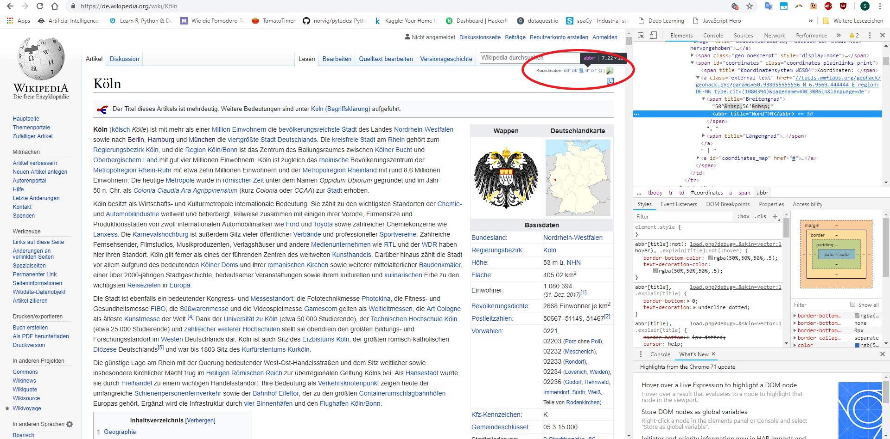
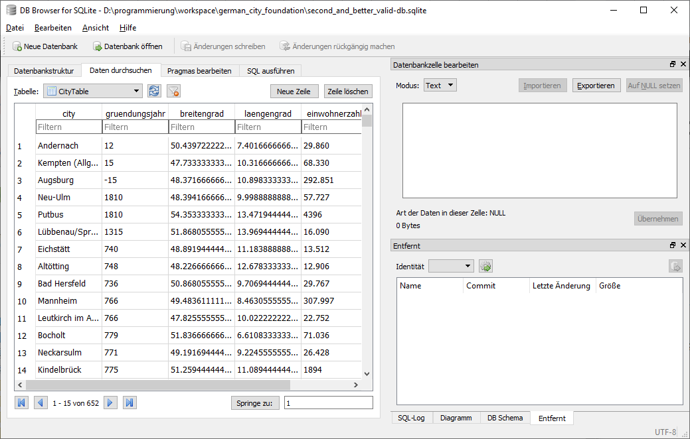
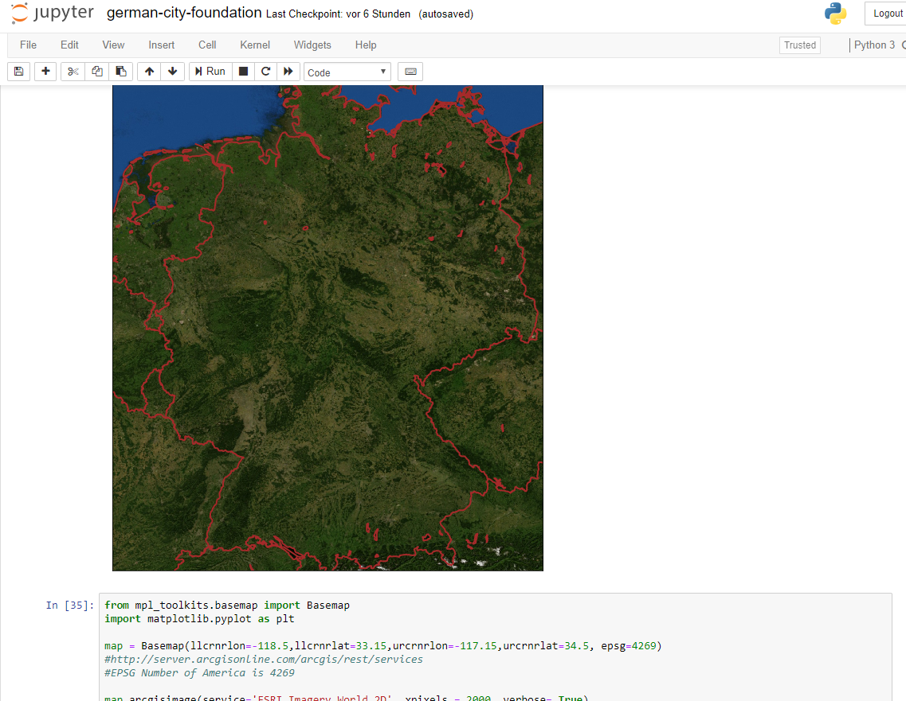

# Web-Scraping von Geodaten, Speicherung (sqlite) und Viualisierung (matplotlib / Tableau) + Animation

Ein kleines, privates Projekt um die scrapy Webcrawler Bibliothek auszuprobieren. 

Startpunkt für den Crawler war die Wikipedia-Seite "Liste deutscher Stadtgründungen"

[Liste deutscher Stadtgründungen](https://de.wikipedia.org/wiki/Liste_deutscher_Stadtgr%C3%BCndungen)

Die Liste ist bei weitem nicht vollständig, aber vollkommen ausreichen für einen Crawler, der von hier aus die Unterseiten ausfindig macht.

Sobald der Crawler eine Unterseite gefunden hatte und die Überschrift mit einer Städteliste erfolgreich abgeglichen hatte hat er Koordinaten und weitere Metadaten in einer sqlite Datenbank abgespeichert.

Diese Daten habe ich in einer sqlite Datenbank abgespeichert.

Im angehängten Jupyter Notebook habe ich mit den Visualisierungs Bibliotheken rumgespielt:

Darin findet sich auch eine Funktion, die die Entstehung der Städte simuliert und daraus eine Animation erstellt:

## Animiert:

### To-Do:
- [x] scraping der Geodaten
- [x] Speichern in Datenbank
- [x] Visualisieren mit matplotlib
- [x] Animation erstellen
- [ ] Animation verschönern
